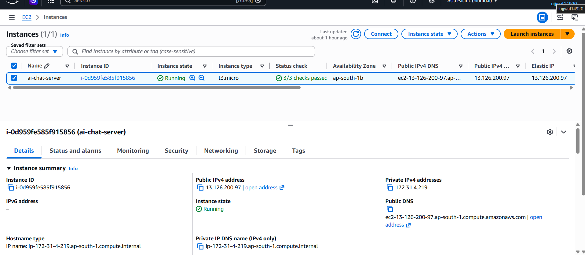
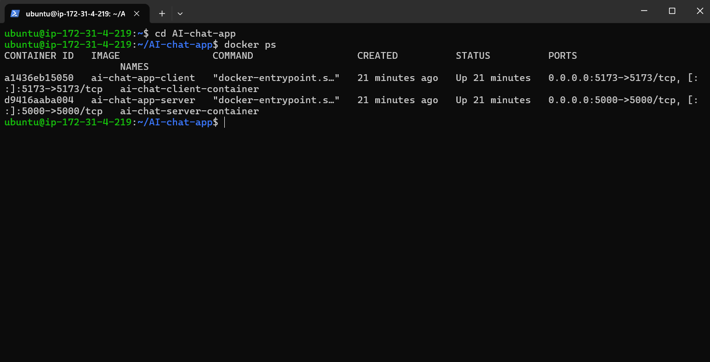
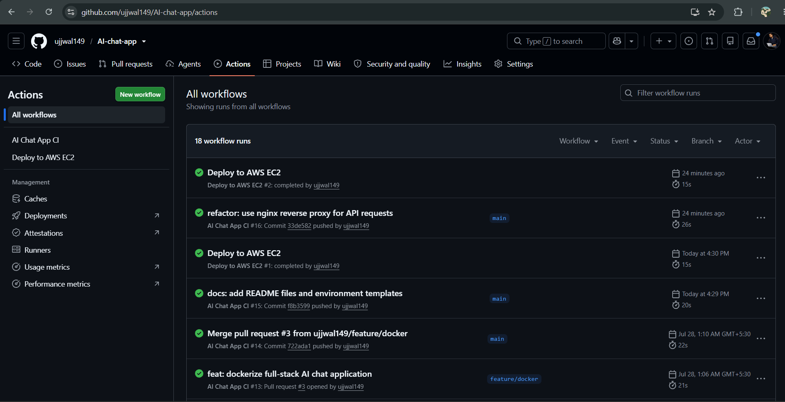
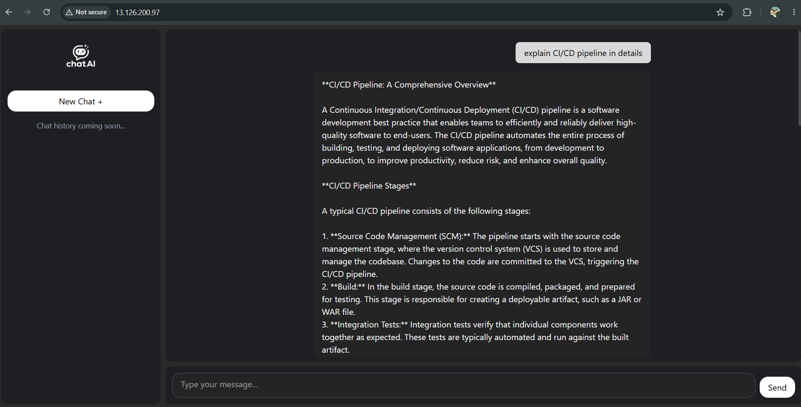

# 🤖 Chat AI Web Application

A full-stack AI chat application that enables users to interact with an AI assistant in real time. The application is built using React, Express, Docker, and AWS, and is deployed through a complete CI/CD pipeline using GitHub Actions.

---

# 📸 Project Preview

> **Add Screenshot:** Home Page / Chat Interface

```text
docs/images/chat-ui.png
```

---

# 🚀 Features

- 💬 Real-time AI chat interaction
- ⚡ Fast and responsive UI
- 📜 Dynamic message rendering
- ✍️ Auto-expanding input box
- ⌨️ Enter to send / Shift + Enter for newline
- 🤖 AI typing indicator
- 🐳 Dockerized frontend and backend
- ☁️ AWS EC2 deployment
- 🔄 Automatic deployment using GitHub Actions
- 🌐 Nginx Reverse Proxy

---

# 🛠️ Tech Stack

## Frontend

- React
- TypeScript
- Vite
- Tailwind CSS
- Axios

## Backend

- Node.js
- Express.js
- Groq API

## DevOps

- Docker
- Docker Compose
- AWS EC2
- Nginx
- GitHub Actions (CI/CD)
- Ubuntu Server

---

# 🏗️ Architecture

```text
                 Git Push
                    │
                    ▼
             GitHub Repository
                    │
                    ▼
            GitHub Actions (CI/CD)
                    │
               SSH Deployment
                    │
                    ▼
              AWS EC2 (Ubuntu)
                    │
            Docker Compose Stack
                    │
          ┌─────────┴─────────┐
          ▼                   ▼
    React (Vite)         Express API
          │                   │
          └─────────┬─────────┘
                    ▼
                 Nginx
                    │
                    ▼
                 Internet
```

---

# 📸 Deployment Screenshots

## AWS EC2 Instance



```text
docs/images/aws-ec2-instance.png
```

---

## Docker Containers



```text
docs/images/docker-ps.png
```

---

## GitHub Actions Deployment



```text
docs/images/github-actions-success.png
```

---

## Application Running



```text
docs/images/application-running.png
```

---

# 📂 Project Structure

```text
ai-chat-app/
│
├── client/
│   ├── src/
│   ├── Dockerfile
│   ├── .env.example
│   └── README.md
│
├── server/
│   ├── controllers/
│   ├── routes/
│   ├── services/
│   ├── Dockerfile
│   ├── .env.example
│   └── README.md
│
├── docker-compose.yml
├── .github/
│   └── workflows/
│       ├── ci.yml
│       └── cd.yml
│
└── README.md
```

---

# ⚙️ Environment Variables

## Client (`client/.env`)

```env
VITE_API_URL=http://localhost:5000
```

When deployed behind Nginx, API requests are proxied through:

```text
/api/chat
```

---

## Server (`server/.env`)

```env
PORT=5000
GROQ_API_KEY=your_groq_api_key
```

---

# 🧑‍💻 Local Development

## Clone Repository

```bash
git clone https://github.com/ujjwal149/AI-chat-app.git

cd AI-chat-app
```

---

## Install Dependencies

### Client

```bash
cd client
npm install
```

### Server

```bash
cd server
npm install
```

---

## Run Development Servers

### Backend

```bash
npm run dev
```

### Frontend

```bash
npm run dev
```

---

# 🐳 Docker

Build and start the application:

```bash
docker compose up -d --build
```

Stop containers:

```bash
docker compose down
```

Check running containers:

```bash
docker ps
```

---

# ☁️ AWS Deployment

The application is deployed on an AWS EC2 Ubuntu instance using Docker Compose.

Deployment includes:

- Docker Engine
- Docker Compose
- Nginx Reverse Proxy
- Elastic IP
- GitHub Actions Continuous Deployment

---

# 🔄 CI/CD Pipeline

Every push to the **main** branch automatically:

- Runs Continuous Integration
- Connects to EC2 through SSH
- Pulls the latest code
- Rebuilds Docker images
- Restarts containers

---

# 🌐 API

## POST `/api/chat`

### Request

```json
{
  "message": "Hello AI"
}
```

### Response

```json
{
  "reply": "Hello! How can I help you?"
}
```

---

# 🎨 UI Highlights

- Modern ChatGPT-inspired interface
- Responsive layout
- Auto-scroll messages
- Typing animation
- Clean dark theme

---

# 🚀 Future Improvements

- User Authentication
- Chat History
- Conversation Memory
- Markdown Rendering
- Image Upload
- Streaming AI Responses
- HTTPS with Let's Encrypt
- Custom Domain
- Monitoring & Logging

---

# 👨‍💻 Author

**Ujjwal Kumar**

- GitHub: https://github.com/ujjwal149

---

# ⭐ Support

If you found this project useful, please consider giving it a ⭐ on GitHub.